# Système orienté graphe : un peu plus loin avec Neo4j

**Binôme** : Nathan, Talbot-Simon, Guillet

/usr/local/neo4j/bin/neo4j start

http://localhost:7474/browser

### Q1 :  Pour importer les données, il faut :
### 1. Faite un copier/coller du fichier donnees_reseau_urbain.txt dans le browser Neo4j.
### 2. Vérifier la création du graphe en affichant le nombre de nœuds et le nombre de relations.
<u>**Commandes**</u>

```bash
MATCH (n)-[r]->(m)
RETURN COUNT(n) AS nb_nodes, COUNT(r) AS nb_rel;
```

<u>**Résultat**</u>

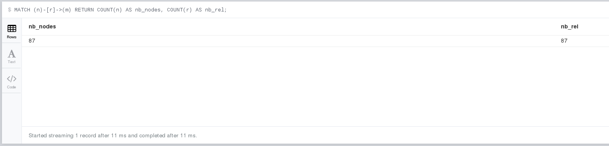

<u>**Explication**</u>

On compte le nombre total de noeuds et de relations.


### Q2 : Afficher le graphe complet de la base de données.

<u>**Commandes**</u>

```bash
MATCH (n)-[r]->(m)
RETURN *;
```

<u>**Résultat**</u>
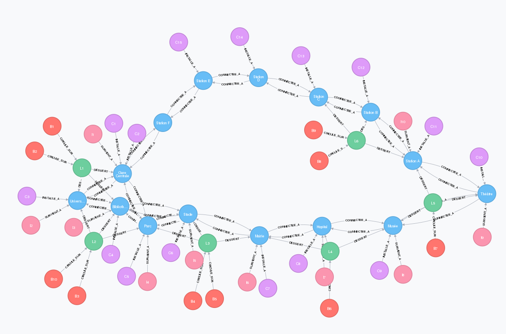


<u>**Explication**</u>

On affiche tous les noeuds ainsi que leurs relations


### Q3 : Donner le diagramme UML correspondant à ce graphe.


<u>**Résultat**</u>

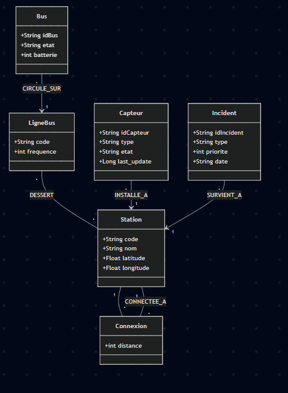


### Q4 : Donner le schéma de la base sous forme de graphe.
<u>**Commandes**</u>

```bash
CALL db.schema.visualization();
```


<u>**Résultat**</u>
 
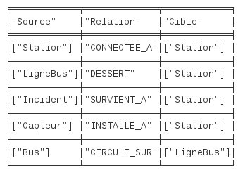


### Q5 : Répondre aux requêtes suivantes :
### Req1 : Quelles sont les stations desservies par la ligne L1.


<u>**Commandes**</u>

```bash
Match(:LigneBus {code:'L1'})-[:DESSERT]->(m)
RETURN(m);
```

<u>**Résultat**</u>

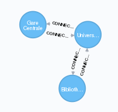

<u>**Explication**</u>

On utilise match pour faire des requète interrogation, puis on créé le chemin de m (ce que l'on cherche) et on return le resultat.


### Req2 : Quels sont les bus actuellement en service, avec la ligne sur laquelle ils circulent.

<u>**Commandes**</u>

```bash
MATCH (b:Bus)-[:CIRCULE_SUR]->(l:LigneBus)
RETURN b, l;
```

<u>**Résultat**</u>

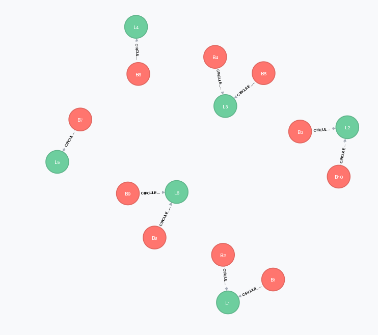

<u>**Explication**</u>

On sélectionne tous les bus ainsi que les lignes sur lesquelles ils circulent


### Req3 : Donner pour chaque station, les incidents de priorité 1 qui s’y produisent.

<u>**Commandes**</u>

```bash
MATCH (s:Station)<-[:SURVIENT_A]-(i:Incident {priorite: 1})
RETURN s, i;
```

<u>**Résultat**</u>

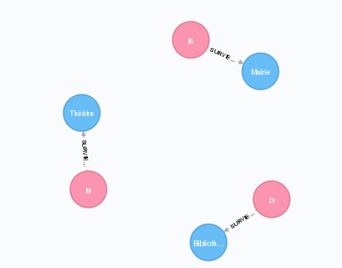

<u>**Explication**</u>
On filtre les stations et leurs relations avec les incidents de priorioté 1


### Req4 : Quelle est la distance entre les stations S1 et S5, en utilisant le chemin le plus court (en nombre de relations).

<u>**Commandes**</u>

```bash
MATCH (s1:Station {code: 'S1'}), (s5:Station {code: 'S5'})
MATCH p = shortestPath((s1)-[:CONNECTEE_A*]-(s5))
RETURN LENGTH(p);
```

<u>**Résultat**</u>

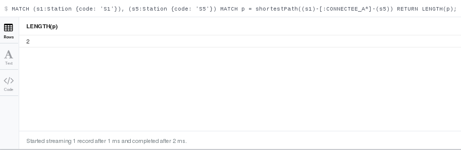

<u>**Explication**</u>
On utilise shortestpath pour trouver le chemin le plus court, on oublie pas de mettre l'* pour indiquer un nombre variable de relations entre s1 et s5

<u>**Vérification**</u>
On a compté a La Mano92 et y en a bien 2.

### Req5 : Quels sont les bus ayant une batterie < 60% ?

<u>**Commandes**</u>

```bash
MATCH (b:Bus)
WHERE b.batterie < 85
RETURN b;
```

<u>**Résultat**</u>

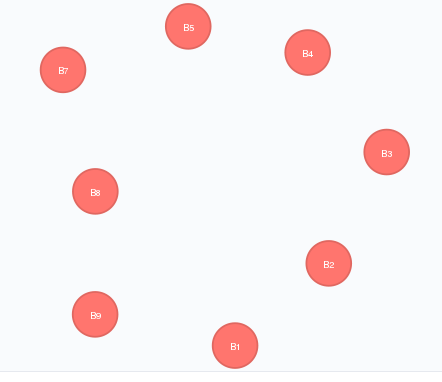

<u>**Explication**</u>
On ne peut pas filtrer la batterie avec un < dans le MATCH donc on utilise un WHERE


### Req6 : Trouver tous les chemins simples entre les stations S1 et S5 comportant au plus 5 sauts, dont la distance totale est strictement inférieure à 2000. Afficher chaque chemin et la distance associée.

<u>**Commandes**</u>

```bash
MATCH p = (a:Station {code: "S1"})-[:CONNECTEE_A*1..5]->(b:Station {code: "S5"})
WITH p, nodes(p) AS ns
WHERE all(n IN ns WHERE single(m IN ns WHERE m = n))
WITH p,
     reduce(dist = 0, r IN relationships(p) | dist + r.distance) AS d
WHERE d < 2000
RETURN p, d
ORDER BY d ASC;
```

<u>**Résultat**</u>

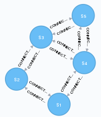

<u>**Explication**</u>
Cette requête recherche tous les chemins entre la station S1 et la station S5 en utilisant la relation CONNECTEE_A, avec un maximum de 5 étapes.
Elle élimine les chemins contenant des boucles afin que chaque station n’apparaisse qu’une seule fois.
La distance totale de chaque chemin est calculée en additionnant les distances des relations.
Seuls les chemins dont la distance est inférieure à 2000 sont conservés et les résultats sont triés du plus court au plus long.


### Req7 : Donner le nombre de stations desservies par chaque ligne.

<u>**Commandes**</u>

```bash
MATCH (l:LigneBus)-[:DESSERT]->(s:Station)
RETURN l, count(s) AS nombreStations;
```

<u>**Résultat**</u>

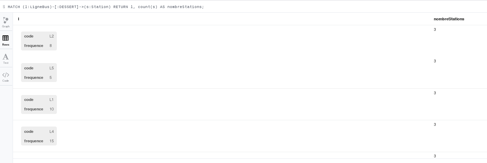

<u>**Explication**</u>
On effectue une sorte de Group By ou on calcule le nombre de stations desservies par ligne


### Req8 : Calculer, pour chaque ligne, la distance totale des connexions entre les stations qu’elle dessert, en ne comptant chaque segment CONNECTEE_A qu’une seule fois. On ne cherche pas le parcours réel de la ligne (qui nécessiterait un ordre), mais uniquement la somme des segments existant entre les stations desservies

<u>**Commandes**</u>

```bash
MATCH (l:LigneBus)-[:DESSERT]->(s1:Station)
MATCH (l)-[:DESSERT]->(s2:Station)
MATCH (s1)-[c:CONNECTEE_A]->(s2)
WHERE id(s1) < id(s2)
RETURN l.code AS LigneBus, sum(c.distance) AS distanceTotale;
```


<u>**Résultat**</u>

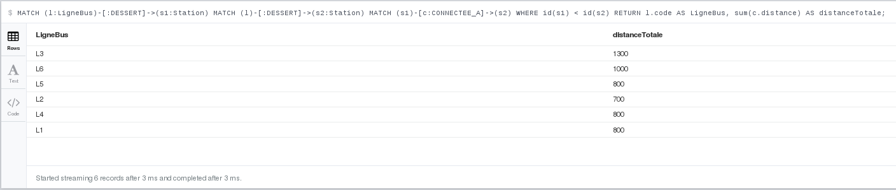

<u>**Explication**</u>
On sélectionne dans un 1er temps toutes les stations (couple de stations) et regarde celles qui sont connectées en évitant les doublons via le WHERE, et calculons la somme des distances.


### Req9 : Donner pour chaque station et pour chaque type d’incident, le nombre d’incidents observés.

<u>**Commandes**</u>

```bash
MATCH (i:Incident)-[:SURVIENT_A]->(s:Station)
RETURN s, i.type, COUNT(*)
```

<u>**Résultat**</u>

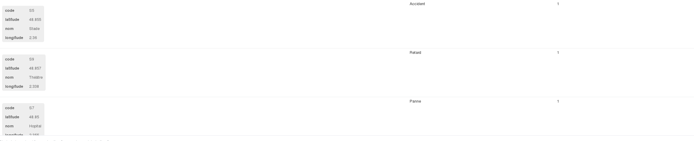

<u>**Explication**</u>
On effectue une sorte de groupBY au niveau des stations et de leurs types d'incidents et en effectuant un count pour chacun de ces groupes.


### Req10 : Calculer la moyenne de batterie des bus par ligne

<u>**Commandes**</u>

```bash
MATCH (b:Bus)-[:CIRCULE_SUR]->(l:LigneBus)
RETURN l,avg(b.batterie)
```

<u>**Résultat**</u>

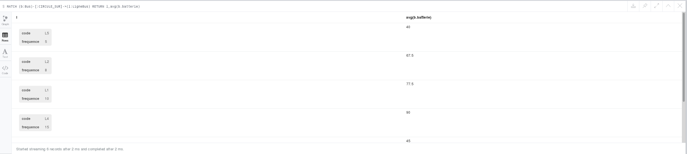

<u>**Explication**</u>

On utilise avg pour calculer la moyenne par ligne


### Req11 : Donner la moyenne des fréquences pour les lignes desservant plus de 2 stations.

<u>**Commandes**</u>

```bash
MATCH (l:LigneBus)-[:DESSERT]->(s:Station)
WITH l, count(s) AS a
WHERE a > 2
RETURN avg(l.frequence)
```


<u>**Résultat**</u>

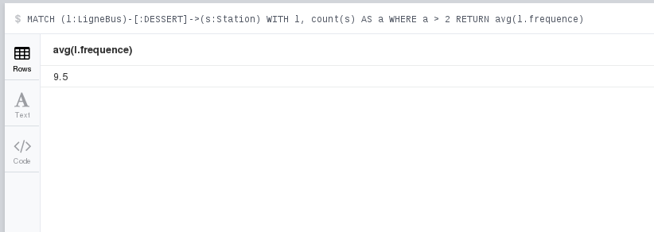

<u>**Explication**</u>
On créé une variable a qui count les nombres de stations traversé par une ligne ce qui permet ensuite de garder les lignes desservant plus de 2 arret et faire la moyenne des fréquences.


### Req12 : Quel est le plus long chemin possible entre deux stations sans repasser par une station déjà visitée. Afficher le chemin et sa longueur en nombre de segments. Quelle remarque peut-on faire sur la difficulté de ce calcul ?


<u>**Commandes**</u>

```bash
MATCH (s1:Station), (s2:Station)
WHERE s1 <> s2
MATCH p = (s1)-[:CONNECTEE_A*]->(s2)
WHERE ALL(n IN nodes(p) WHERE single(m IN nodes(p) WHERE m = n))
RETURN
  [n IN nodes(p) | n.code] AS chemin,
  length(p) AS nb_segments
ORDER BY nb_segments DESC
LIMIT 1;

```
MATCH p = (s1:Station)-[:CONNECTEE_A*]->(s2:Station)
WHERE s1 <> s2
AND ALL(n IN nodes(p) WHERE size([m IN nodes(p) WHERE m = n]) = 1)
RETURN [n IN nodes(p) | n.code] AS chemin, length(p) AS nb_segments ORDER BY nb_segments DESC LIMIT 1;

<u>**Résultat**</u>


<u>**Explication**</u>
On sélectionne dans un 1er temps toutes les stations (couple de stations) et regarde celles qui sont connectées en évitant les doublons via le WHERE, et calculons la somme des distances.


### Req13 : Trouver les stations ayant plus de 2 incidents de priorité 1 afin d’aider au monitoring et de déclencher une éventuelle maintenance.

<u>**Commandes**</u>

```bash
MATCH (i:Incident {priorite: 1})-[:SURVIENT_A]->(s:Station)
WITH s, count(i) AS a
WHERE a > 2
RETURN s
```


<u>**Résultat**</u>

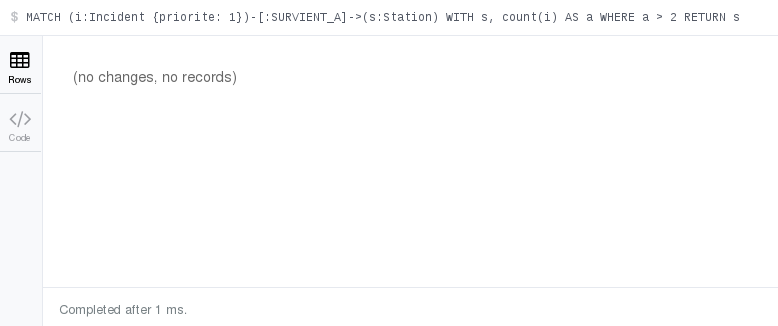

<u>**Explication**</u>
On filtre les incidents de priorité 1 puis gardons les stations avec + de 2 incidents, et il y en a pas


### Req14 : Y a-t-il des stations isolées, c’est-à-dire des composantes connexes d’un point de vue graphe ?

<u>**Commandes**</u>

```bash
MATCH (s:Station)
WHERE NOT (s)--()
RETURN s;
```


<u>**Résultat**</u>


<u>**Explication**</u>
On filtre les stations qui n'ont aucune relation.

<u>**Vérification**</u>
```bash
MATCH (s:Station) 
RETURN s;
```
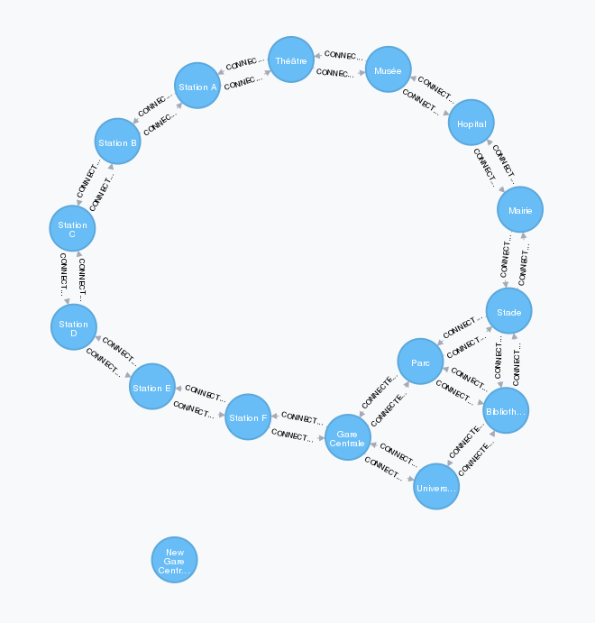


### Req15 : Pour chaque type d’incident, calculer le temps moyen écoulé (en jours) depuis sa date d’occurrence.

<u>**Commandes**</u>

```bash
MATCH (i:Incident)
WITH i.type AS typeIncident,
     toInteger(substring(i.date, 0, 4)) AS annee,
     toInteger(substring(i.date, 5, 2)) AS mois,
     toInteger(substring(i.date, 8, 2)) AS jour
WITH typeIncident,
     ((2025 - annee) * 365 + (12 - mois) * 30 + (31 - jour)) AS joursEcoules
RETURN typeIncident,
       round(avg(joursEcoules), 2) AS tempsMoyenEnJours
ORDER BY typeIncident;
```


<u>**Résultat**</u>

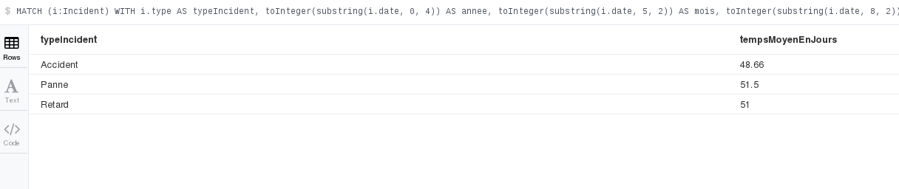

<u>**Explication**</u>
On convertit les dates de string à integer pour pouvoir les comparer avec la date actuelle et calculer la durée moyenne.


### Req16 : Trouver tous les incidents survenus dans les 7 derniers jours.

<u>**Commandes**</u>

```bash
MATCH (i:Incident)
WITH i,
     toInteger(substring(i.date, 0, 4)) AS annee,
     toInteger(substring(i.date, 5, 2)) AS mois,
     toInteger(substring(i.date, 8, 2)) AS jour
WITH i,
     ((2025 - annee) * 365 + (12 - mois) * 30 + (31 - jour)) AS joursEcoules
WHERE joursEcoules <= 7
RETURN i
ORDER BY i.date DESC;
```


<u>**Résultat**</u>

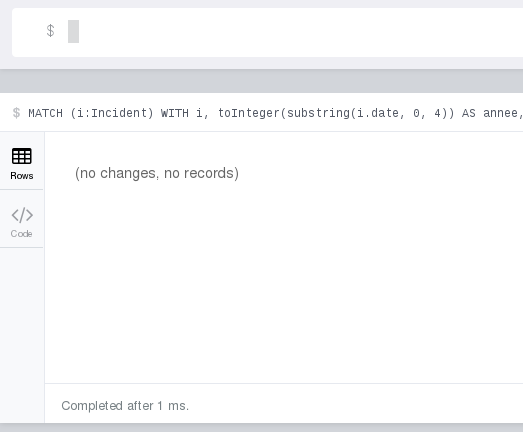

<u>**Explication**</u>
On reprend la meme commande qu'à la question précédente sauf que l'on filtre les incidents qui ont une valeur <= 7 pour leur valeur joursEcoules associée


### Req17 : Quelle est la station la plus centrale ?

<u>**Commandes**</u>

```bash
MATCH (s:Station)-[r:CONNECTEE_A]-()
RETURN s.nom AS station, count(r) AS nb_connexion
ORDER BY nb_connexion DESC
LIMIT 1;
```

<u>**Résultat**</u>

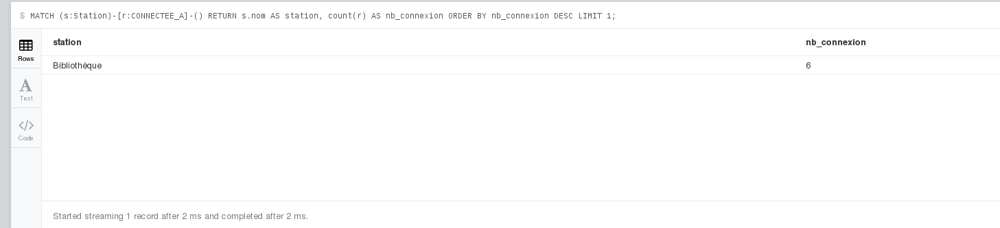

<u>**Explication**</u>
On compte le nombre de relation par station et trie les stations en fonction de ce résultat puis garde la valeur max


### Req18 : Calculer la durée moyenne entre deux incidents consécutifs, tous types confondus.

<u>**Commandes**</u>

```bash
MATCH (i:Incident)
WITH i,
     toInteger(substring(i.date,0,4)) AS annee,
     toInteger(substring(i.date,5,2)) AS mois,
     toInteger(substring(i.date,8,2)) AS jour
WITH i,
     (annee*365 + mois*30 + jour) AS joursDepuisEpoch
ORDER BY joursDepuisEpoch ASC
WITH collect(joursDepuisEpoch) AS joursList
WITH [i IN range(1, size(joursList)-1) | joursList[i] - joursList[i-1]] AS diffs
UNWIND diffs AS diff
RETURN toFloat(toInteger(avg(diff)*100))/100 AS dureeMoyenneEnJours;
```


<u>**Résultat**</u>

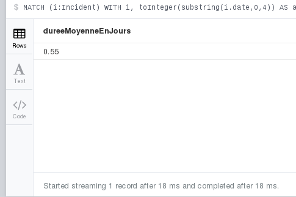

<u>**Explication**</u>
On convertit les dates comme précedemment, puis les trient chronologiquement avant de calculer la différence entre chaque date consécutive.


### Req19 : Utiliser OPTIONAL MATCH pour récupérer toutes les stations ainsi que les capteurs installés, mêmes celles n’en n’ayant aucun.

<u>**Commandes**</u>

```bash
MATCH (s:Station)
OPTIONAL MATCH (c:Capteur)-[:INSTALLE_A]->(s)
RETURN s.nom AS station, 
       COLLECT(c.idCapteur) AS capteurs
ORDER BY station;

```


<u>**Résultat**</u>

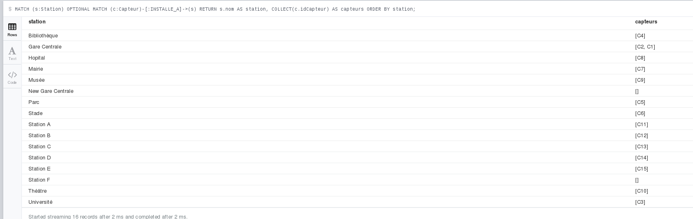

<u>**Explication**</u>
On regarde toutes les stations qui sont connectées ou non à un capteur et récupère tous les capteurs par station dans une liste


### Req20 : Quelles lignes partagent au moins une station en commun ?

<u>**Commandes**</u>

```bash
MATCH (s:Station)<-[:DESSERT]-(l1:LigneBus),
      (s)<-[:DESSERT]-(l2:LigneBus)
WHERE l1 <> l2
RETURN DISTINCT l1.code AS ligne1, 
                l2.code AS ligne2, 
                COLLECT(s.nom) AS stationsCommune
ORDER BY ligne1, ligne2;
```


<u>**Résultat**</u>

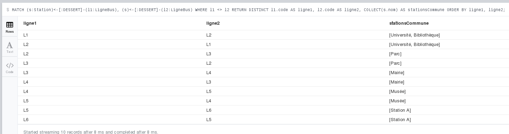

<u>**Explication**</u>
On récupère une liste de toutes les stations partagées entre chaque "couple" de Lignes différentes (au moins 1 station partagée)


### Req21 : Quelles lignes permettent de relier S1 et S5 ?

<u>**Commandes**</u>

```bash
MATCH (l:LigneBus)-[:DESSERT]->(s1:Station {code:'S1'}),
      (l)-[:DESSERT]->(s5:Station {code:'S5'})
RETURN l.code AS ligne
ORDER BY l.code;
```


<u>**Résultat**</u>

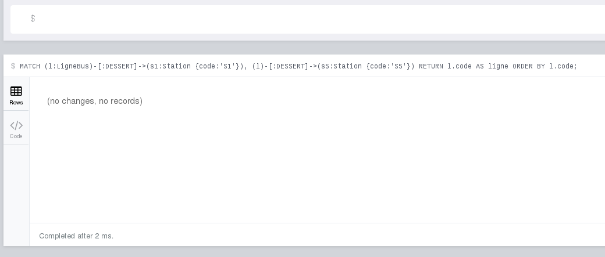

<u>**Explication**</u>
On regarde toutes les lignes entre la station 1 et la 5, mais il n'y en a pas.


### Req22(c'est la quequequequequetion BONUS) : Trouver toutes les lignes qui desservent au moins une station située à moins de 600 m de S1.

<u>**Commandes**</u>

```bash
MATCH (station:Station)-[c:CONNECTEE_A]->(s1:Station {code: 'S1'})
WHERE c.distance < 600
MATCH (l:LigneBus)-[:DESSERT]->(station)
RETURN l;
```

<u>**Résultat**</u>

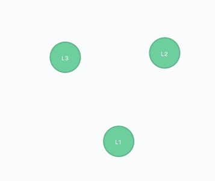

<u>**Explication**</u>
On filtre les stations à moins de 600m de la S1 puis sélectionnent toutes les lignes qui desservent ces station


### Q6 : Rédiger un court paragraphe répondant aux questions suivantes
### 1 : Dans une requête Neo4j, les conditions peuvent être écrites au niveau du MATCH ou au niveau du WHERE. Quelles sont les recommandations à suivre ?
Il est recommandé de placer les conditions structurelles (labels, types de relations, directions) directement dans le MATCH pour améliorer la lisibilité et aider l’optimiseur. Les conditions de filtrage sur les propriétés doivent plutôt être placées dans le WHERE pour une meilleure clarté et une optimisation efficace.
### 2 : Quelles sont les limites des requêtes shortestPath et allShortestPaths dans des graphes de grande taille.
Les fonctions shortestPath et surtout allShortestPaths peuvent devenir très coûteuses en temps et en mémoire sur des graphes de grande taille. Elles explorent potentiellement un grand nombre de chemins, ce qui peut entraîner des performances très dégradées voire des erreurs de dépassement de ressources.
### 3 : Pour améliorer les performances des requêtes sur ce graphe, quelles optimisations sont possibles ? Quels index seraient pertinents ?
Pour améliorer les performances, il faut limiter les parcours, éviter les shortestPath non contraints, et privilégier des requêtes ciblées sur des points d’entrée bien définis. Des index (ou contraintes d’unicité) sont pertinents sur Station(code), Bus(idBus), LigneBus(code), Capteur(idCapteur) et Incident(idIncident) car ces propriétés sont systématiquement utilisées dans les MATCH.
### 4 : Lorsque le nombre de nœuds atteint plusieurs millions, quelles sont les limitations de Neo4j ?
Lorsque le graphe atteint plusieurs millions de nœuds, la consommation mémoire devient un facteur critique, notamment pour le cache et les traversées complexes. Les requêtes non sélectives ou mal indexées peuvent entraîner des temps de réponse élevés et des problèmes de scalabilité.