# MongoDB : partie 1

**Binôme** : Nathan, Talbot-Simon, Guillet


### Q1 : Créer la base de données CoursesBio contenant la collection ProduitBio

<u>**Commandes**</u>

```bash
use CoursesBio
db.createCollection("ProduitsBio")
```

<u>**Résultat**</u>

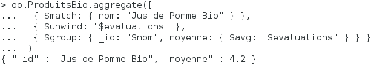

<u>**Explication**</u>

On crée la base de nom CoursesBio avec la commande : use CoursesBio.  
La collection ProduitsBio est créé au moyen de la commande db.createCollection("ProduitsBio ").  
La variable db représente une instance de la base de données


<u>**Vérification**</u>

```bash
db
show collections
```


### Q2 : Insérer dans la collection ProduitBio, 3 produits bios. Chaque produit bio se caractérise par un nom, une catégorie (ex : Fruits, Légumes, Boissons, Epicerie) et un prix (en euros). Vérifier que la collection contient bien tous ces documents.

<u>**Commandes**</u>

```bash
db.ProduitsBio.insertMany([
	{"nom" : "Avocat", "categorie" : "fruit", "prix" : 2.5},
	{"nom" : "Fraise", "categorie" : "fruit", "prix" : 5},
	{"nom" : "Salade", "categorie" : "légume", "prix" : 1.5}
])
```

<u>**Résultat**</u>
 
 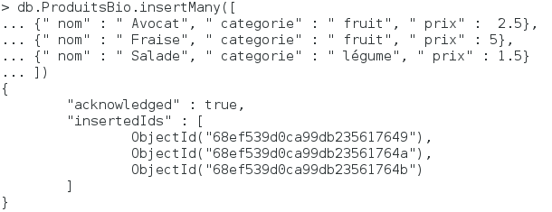

<u>**Explication**</u>

On ajoute une liste de documents à la collection ProduitsBio.


<u>**Vérification**</u>

```bash
db.ProduitsBio.find()
```


### Q3 : Insérer un produit nommé « Pomme Bio Gala » de la catégorie Fruits et au prix de 3.20€/kg, au moyen d’un objet JavaScript.

<u>**Commandes**</u>

```bash
var ProduitBio = {}
ProduitBio.nom = "Pomme Bio Gala"
ProduitBio.categorie = "Fruits"
ProduitBio.prix = 3.2 
db.ProduitsBio.insert(ProduitBio)
```

<u>**Résultat**</u>
 
 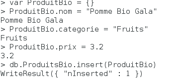

<u>**Explication**</u>

On ajoute un document correspondant à Pomme Bio Gala à la collection ProduitsBio.


<u>**Vérification**</u>

```bash
db.ProduitsBio.find()
```


### Q4 : Corriger le prix de la Pomme Bio Gala à 2.90€/kg et ajouter le champ origine : « France ».

<u>**Commandes**</u>

```bash
db.ProduitsBio.updateOne(
  {"nom" : "Pomme Bio Gala"},
  {$set : {"prix": 2.9, "origine": "France"}}
)
```


<u>**Résultat**</u>
 
 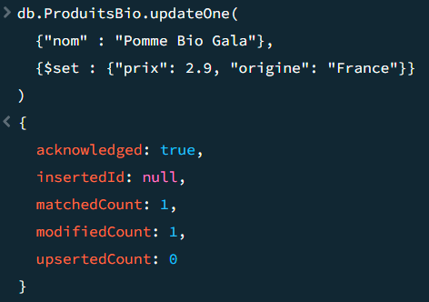

<u>**Explication**</u>

On instancie une variable pour modifier le fruit en question, puis modifie le champ prix et ajoute le champ origine, avant de sauvegarder les modifications.


<u>**Vérification**</u>

```bash
db.ProduitsBio.find()
```


### Q5 : Afficher le prix et l’origine du produit Pomme Bio Gala.

<u>**Commandes**</u>

```bash
db.ProduitsBio.find({"nom" : "Pomme Bio Gala"}, {_id: 0, "prix" : 1,"origine" : 1})
```


<u>**Résultat**</u>

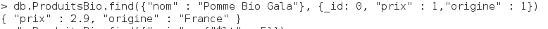 

<u>**Explication**</u>

On cherche a récupérer uniquement les champs prix et origine du document Pomme Bio Gala.


<u>**Vérification**</u>

```bash
```


### Q6 : Donner les produits dont le prix est inférieur à 5 €.

<u>**Commandes**</u>

```bash
db.ProduitsBio.find({"prix" : {"$lt" : 5}})
```


<u>**Résultat**</u>
 
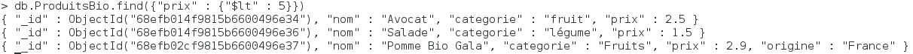

<u>**Explication**</u>

On filtre les produits dont le prix est inférieur à 5€ via l’opérateur $lt


<u>**Vérification**</u>

```bash
```

### Q7 : Ajouter un produit « Jus de Pomme Bio », catégorie Boissons, prix 4.10. Afficher les noms et catégories des produits dont le nom commence par J, triés par prix décroissant.

<u>**Commandes**</u>

```bash
var ProduitBio = {}
ProduitBio.nom = "Jus de Pomme Bio"
ProduitBio.categorie = "Boissons"
ProduitBio.prix = 4.10
db.ProduitsBio.insert(ProduitBio)

db.ProduitsBio.find(
  { nom: /^J/ },                  
  { nom: 1, categorie: 1, _id: 0 } 
).sort({ prix: -1 })  
```

<u>**Résultat**</u>
 
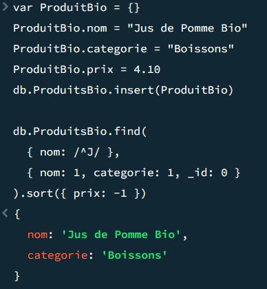

<u>**Explication**</u>

On créer une variable représentant le nouveau produit, que l'on insert dans la collection puis on affiche les noms et catégories des produits avec le filtre effectué sur les documents.


<u>**Vérification**</u>

```bash
db.ProduitsBio.find()
```

### Q8 : Combien de produits bio coûtent plus de 3 € ?

<u>**Commandes**</u>

```bash
db.ProduitsBio.find({"prix": {"$gt": 3}}).count()
```

<u>**Résultat**</u>

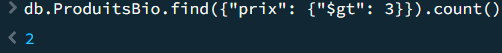

<u>**Explication**</u>

On filtre dans un premier temps les produits en fonction de leur prix avant de compter le nombre d'occurences trouvées.


<u>**Vérification**</u>

```bash
```

### Q9 : Afficher les produits de la base (maximum 3)

<u>**Commandes**</u>

```bash
db.ProduitsBio.find().limit(3)
```

<u>**Résultat**</u>
 
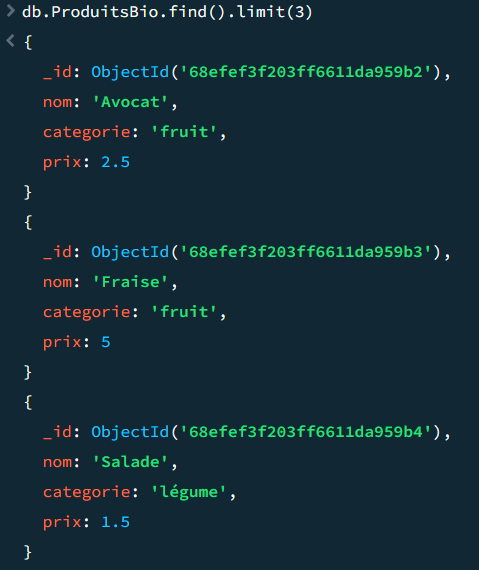

<u>**Explication**</u>

On limite le nombre de produits affichés à 3


<u>**Vérification**</u>

```bash
```

### Q10 : Afficher les statistiques de la base (db.stats()) et commenter les informations obtenues.

<u>**Commandes**</u>

```bash
db.stats()
```

<u>**Résultat**</u>
 
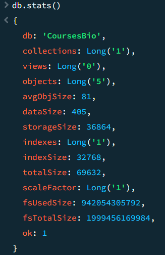

<u>**Explication**</u>

La commande db.stats() permet d'afficher des statistiques générales sur la base de données actuelle. Ces statistiques incluent des informations telles que :

- Nombre de collections : Le nombre total de collections dans la base de données.
- Nombre d'objets : Le nombre total de documents dans toutes les collections.
- Taille totale des données : La taille totale des données stockées dans la base de données.
- Taille des index : La taille totale des index créés pour optimiser les recherches.
Espace alloué : L'espace disque alloué pour la base de données.


<u>**Vérification**</u>

```bash
```

### Q11 : Créer une collection PanierBio et insérer un panier pour la cliente Claire M. avec : 
### -client: "Claire M."
### -date: new Date()
### -produits: [ { nom: "Pomme Bio Gala", quantite: 2, prix_unitaire: 2.90 }, { nom: "Jus de Pomme Bio", quantite: 1, prix_unitaire: 4.10 } ]
### Vérifier l’insertion du panier.
<u>**Commandes**</u>

```bash
db.createCollection("PanierBio")
db.PanierBio.insertOne({
	"client": "Claire M.",
	"date": new Date(),
	"produits": [
		{
			"nom": "Pomme Bio Gala",
			"quantite": 2,
			"prix_unitaire": 2.9
		},
		{
			"nom": "Jus de Pomme Bio",
			"quantite": 1,
			"prix_unitaire": 4.1
		}
	],
})
```

<u>**Résultat**</u>
 
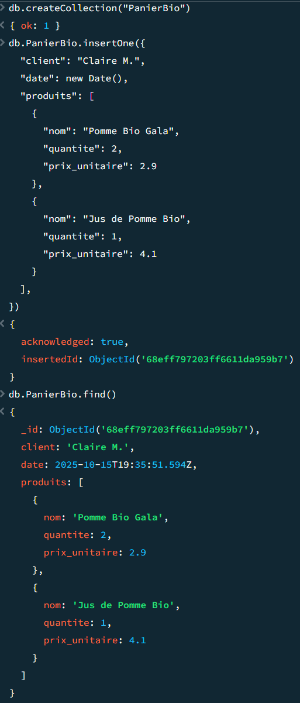

<u>**Explication**</u>

On créé une nouvelle collection, puis ajoute un nouveau panier avec notamment une valeur qui est en fait un tableau de clé/valeur


<u>**Vérification**</u>

```bash
db.PanierBio.find()
```

### Q12 : Ajouter une note de satisfaction pour « Jus de Pomme Bio » : evaluations: [5].

<u>**Commandes**</u>

```bash
db.ProduitsBio.updateOne(
  {"nom" : "Jus de Pomme Bio"},
  {$set : {"evaluations": [5]}}
)
```

<u>**Résultat**</u>
 
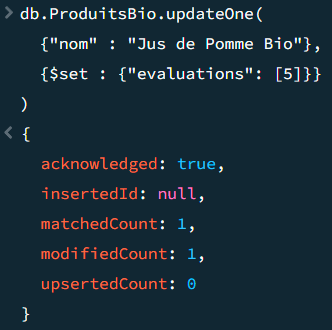

<u>**Explication**</u>

On ajoute au produit en question un nouveau champs contenant un tableau d'évaluations


<u>**Vérification**</u>

```bash
db.ProduitsBio.find()
```

### Q13 : Ajouter d’autres évaluations pour le même produit : 4, 5, 3, 4. ($push avec $each.).

<u>**Commandes**</u>

```bash
db.ProduitsBio.update({"nom": "Jus de Pomme Bio"}, {"$push": {"evaluations":{$each : [4, 5, 3, 4]}}})
```

<u>**Résultat**</u>
 
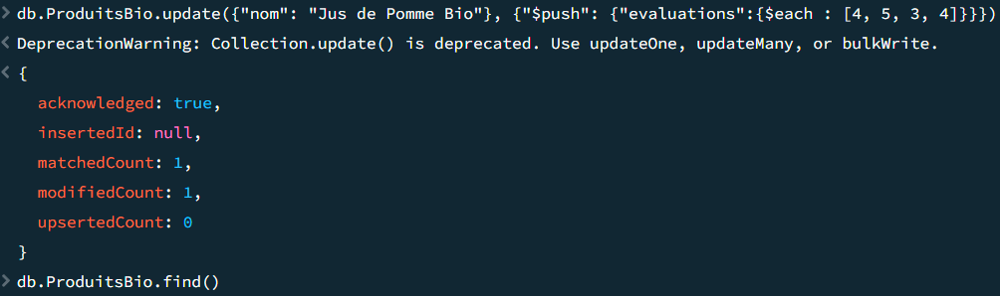

<u>**Explication**</u>

On ajoute des valeurs en fin de tableau avec la commande Push et plusieurs evaluations avec la méthode Each


<u>**Vérification**</u>

```bash
db.ProduitsBio.find()
```

### Q14 : Calculer la moyenne des évaluations du « Jus de Pomme Bio » à l’aide d’une agrégation :
### db.ProduitBio.aggregate([
### { $match: { nom: "Jus de Pomme Bio" } },
### { $unwind: "$evaluations" },
### { $group: { _id: "$nom", moyenne: { $avg: "$evaluations" } } }])

<u>**Commandes**</u>

```bash
db.ProduitsBio.aggregate([
  { $match: { nom: "Jus de Pomme Bio" } },
  { $unwind: "$evaluations" },
  { $group: { _id: "$nom", moyenne: { $avg: "$evaluations" } } }
])
```

<u>**Résultat**</u>

 

<u>**Explication**</u>

$match : sélectionne le document correspondant au produit.

$unwind : "déplie" le tableau evaluations en plusieurs documents.

$group : regroupe les documents dépliés et calcule la moyenne avec $avg.


<u>**Vérification**</u>

```bash

```

### Q15 : Sous Robomongo, ouvrir la base CoursesBio et vérifier la présence des collections ProduitBio et PanierBio.
### Réaliser à la main les opérations des questions 12 à 14 via l’interface graphique

<u>**Commandes**</u>

```bash
/usr/local/robomongo/bin/robomongo
```

<u>**Résultat**</u>
 
 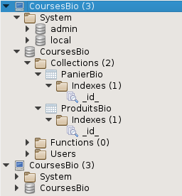

 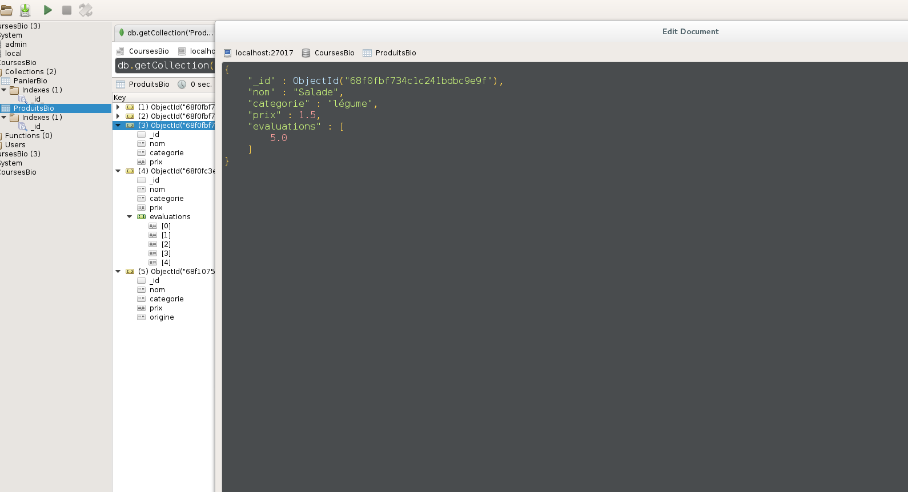

 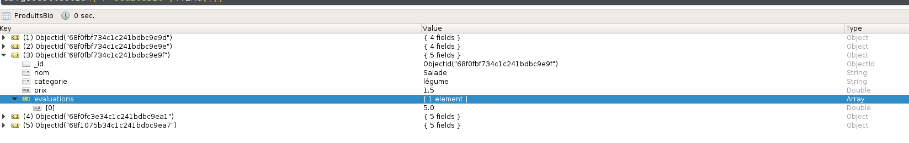

 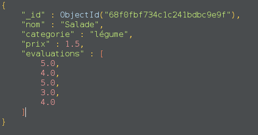

 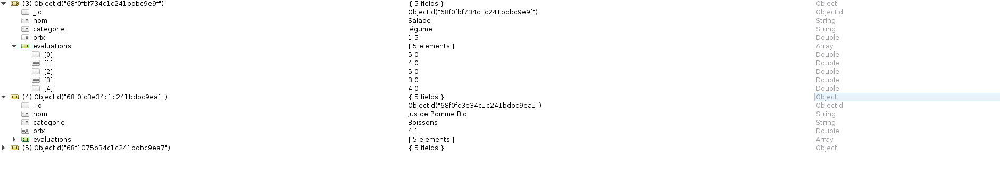

 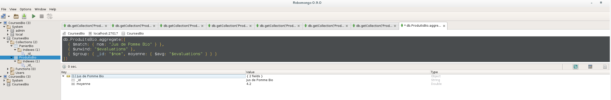

<u>**Explication**</u>

Cette manipulation montre l’intérêt d’une interface graphique pour gérer les documents et effectuer des requêtes plus visuelles.


<u>**Vérification**</u>

```bash
```

### Q16 : Supprimer le champ origine du produit Pomme Bio Gala

<u>**Commandes**</u>

```bash
db.ProduitsBio.updateOne(
  { nom: "Pomme Bio Gala" },
  { $unset: { origine: "" } }
)
```

<u>**Résultat**</u>
 
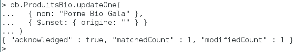

<u>**Explication**</u>

La commande $unset permet de supprimer un champ d’un document.
Ici, on supprime le champ "origine" du produit "Pomme Bio Gala".


<u>**Vérification**</u>

```bash
db.ProduitsBio.find({ nom: "Pomme Bio Gala" })
```

### Q17 :  Supprimer d’abord la collection ProduitBio, puis la base CoursesBio.

<u>**Commandes**</u>

```bash
db.ProduitsBio.drop()     
db.dropDatabase()        
```

<u>**Résultat**</u>

 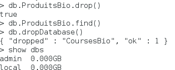

<u>**Explication**</u>

drop() supprime une collection spécifique (ProduitsBio)

dropDatabase() supprime toute la base de données (CoursesBio)

<u>**Vérification**</u>

```bash

db.PanierBio.find()
show dbs

```